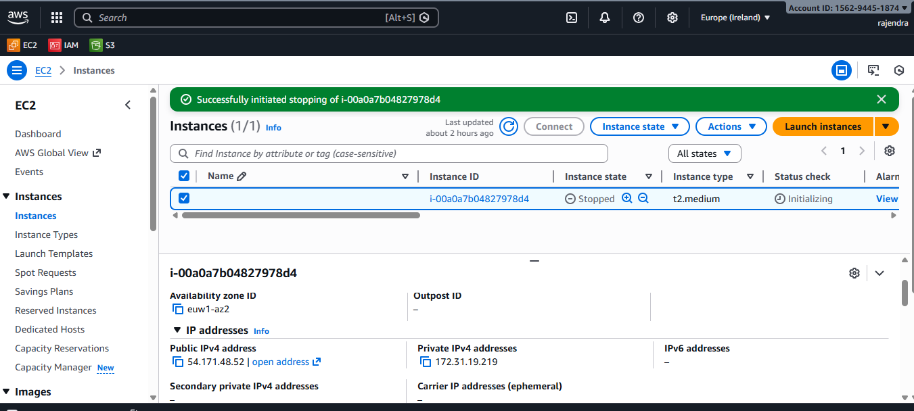
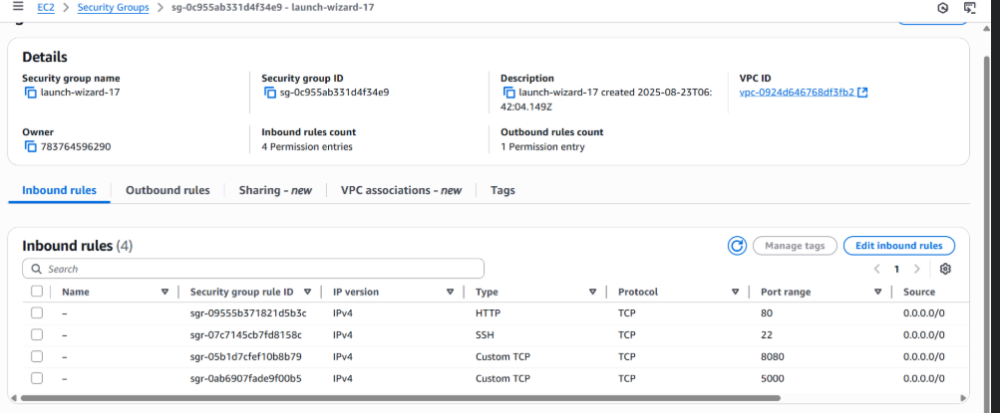

 
## End-to-End 2-Tier Flask Application Deployment using DevSecOps on AWS EKS


**Author:** Rajendra


## Tech stack used in this project:
- GitHub (Code)
- Docker (Containerization)
- Jenkins (CI)
- OWASP (Dependency check)
- SonarQube (Quality)
- Trivy (Filesystem Scan)
- ArgoCD (CD)
- AWS EKS (Kubernetes)
- Helm (Monitoring using grafana and prometheus)

---
#
> [!Note]
> This project will be implemented on Eurup Ireland region (eu-west-1).
> <b>Create 1 Master machine on AWS (t2.large) and 29 GB of storage.</b>

- <b>Open the below ports in security group</b>

### Steps to deploy:

- <b id="EKS">Create EKS Cluster on AWS</b>
- IAM user with **access keys and secret access keys**
- <b>Create EKS Cluster</b>
  ```bash
  eksctl create cluster --name=flaskapp --region=eu-west-1  --version=1.34 --without-nodegroup
  ```
### **Table of Contents**
1. [Project Overview](#1-project-overview)
2. [Architecture Diagram](#2-architecture-diagram)
3. [Step 1: AWS EC2 Instance Preparation](#3-step-1-aws-ec2-instance-preparation)
4. [Step 2: Install Dependencies on EC2](#4-step-2-install-dependencies-on-ec2)
5. [Step 3: Jenkins Installation and Setup](#5-step-3-jenkins-installation-and-setup)
6. [Step 4: GitHub Repository Configuration](#6-step-4-github-repository-configuration)
    * [Dockerfile](#dockerfile)
    * [docker-compose.yml](#docker-composeyml)
    * [Jenkinsfile](#jenkinsfile)
7. [Step 5: Jenkins Pipeline Creation and Execution](#7-step-5-jenkins-pipeline-creation-and-execution)
8. [Conclusion](#8-conclusion)
9. [Infrastructure Diagram](#9-infrastructure-diagram)
10. [Work flow Diagram](#10-work-flow-diagram)

---

### **1. Project Overview**
This document outlines the step-by-step process for deploying a 2-tier web application (Flask + MySQL) on an AWS EC2 instance. The deployment is containerized using Docker and Docker Compose. A full CI/CD pipeline is established using Jenkins to automate the build and deployment process whenever new code is pushed to a GitHub repository.

---

### **2. Architecture Diagram**

```
+-----------------+      +----------------------+      +-----------------------------+
|   Developer     |----->|     GitHub Repo      |----->|    Jenkins Server           |
| (pushes code)   |      | (Source Code Mgmt)   |      |  (on AWS EC2)               |
+-----------------+      +----------------------+      |                             |
                                                       | 1. Clones Repo              |
                                                       | 2. Trivy File scan          |
                                                       | 3. Builds Docker Image      |
                                                       | 2. Push to Docker Hub       |
                                                       | 3. Runs Docker Compose      |
                                                       +--------------+--------------+
                                                                      |
                                                                      | Deploys
                                                                      v
                                                       +-----------------------------+
                                                       |      Application Server     |
                                                       |      (Same AWS EC2)         |
                                                       |                             |
                                                       | +-------------------------+ |
                                                       | | Docker Container: Flask | |
                                                       | +-------------------------+ |
                                                       |              |              |
                                                       |              v              |
                                                       | +-------------------------+ |
                                                       | | Docker Container: MySQL | |
                                                       | +-------------------------+ |
                                                       +-----------------------------+
```

---

### **3. Step 1: AWS EC2 Instance Preparation**

1.  **Launch EC2 Instance:**
    * Navigate to the AWS EC2 console.
    * Launch a new instance using the **Ubuntu 24.04 LTS** AMI.
    * Select the **t2.medium** instance type for free-tier eligibility.
    * Create and assign a new key pair for SSH access.



2.  **Configure Security Group:**
    * Create a security group with the following inbound rules:
        * **Type:** SSH, **Protocol:** TCP, **Port:** 22, **Source:** Your IP
        * **Type:** HTTP, **Protocol:** TCP, **Port:** 80, **Source:** Anywhere (0.0.0.0/0)
        * **Type:** Custom TCP, **Protocol:** TCP, **Port:** 5000 (for Flask), **Source:** Anywhere (0.0.0.0/0)
        * **Type:** Custom TCP, **Protocol:** TCP, **Port:** 8080 (for Jenkins), **Source:** Anywhere (0.0.0.0/0)



3.  **Connect to EC2 Instance:**
    * Use SSH to connect to the instance's public IP address.
    ```bash
    ssh -i /path/to/key.pem ubuntu@<ec2-public-ip>
    ```

---

### **4. Step 2: Install Dependencies on EC2**

1.  **Update System Packages:**
    ```bash
    sudo apt update && sudo apt upgrade -y
    ```

2.  **Install Git, Docker, and Docker Compose:**
    ```bash
    sudo apt install docker.io docker-compose-v2 -y
    ```

3.  **Start and Enable Docker:**
    ```bash
    sudo systemctl start docker
    sudo systemctl enable docker
    ```

4.  **Add User to Docker Group (to run docker without sudo):**
    ```bash
    sudo usermod -aG docker $USER
    newgrp docker
    ```

---

### **5. Step 3: Jenkins Installation and Setup**

1.  **Install Java (OpenJDK 17):**
    ```bash
    sudo apt update
    sudo apt install fontconfig openjdk-21-jre -y
    ```

2.  **Add Jenkins Repository and Install:**
    ```bash
    sudo wget -O /etc/apt/keyrings/jenkins-keyring.asc \
    https://pkg.jenkins.io/debian-stable/jenkins.io-2023.key
    echo "deb [signed-by=/etc/apt/keyrings/jenkins-keyring.asc]" \
    https://pkg.jenkins.io/debian-stable binary/ | sudo tee \
    /etc/apt/sources.list.d/jenkins.list > /dev/null
    sudo apt update
    sudo apt install jenkins
    ```

3.  **Start and Enable Jenkins Service:**
    ```bash
    sudo systemctl start jenkins
    sudo systemctl enable jenkins
    ```

4.  **Initial Jenkins Setup:**
    * Retrieve the initial admin password:
        ```bash
        sudo cat /var/lib/jenkins/secrets/initialAdminPassword
        ```
    * Access the Jenkins dashboard at `http://<ec2-public-ip>:8080`.
    * Paste the password, install suggested plugins, and create an admin user.

5.  **Grant Jenkins Docker Permissions:**
    ```bash
    sudo usermod -aG docker jenkins
    sudo systemctl restart jenkins
    ```
 

---

### **6. Step 4: GitHub Repository Configuration**

Ensure your GitHub repository contains the following three files.

#### **Dockerfile**
This file defines the environment for the Flask application container.
```dockerfile
    # =========================
    # Stage 1: Builder
    # =========================
    FROM python:3.9 AS builder

    WORKDIR /app

    RUN apt-get update && apt-get install -y \
        gcc \
        default-libmysqlclient-dev \
        pkg-config \
        && rm -rf /var/lib/apt/lists/*

    COPY requirement.txt .

    RUN pip install --no-cache-dir -r requirement.txt

    COPY . .


    # =========================
    # Stage 2: Runtime
    # =========================
    FROM python:3.9-slim

    WORKDIR /app

    RUN apt-get update && apt-get install -y \
        libmariadb3 \
        && rm -rf /var/lib/apt/lists/*
    # Copy python dependencies 

    COPY --from=builder /usr/local/lib/python3.9/site-packages \
                        /usr/local/lib/python3.9/site-packages

    COPY --from=builder /app /app

    EXPOSE 5000

    CMD ["python", "app.py"]

```

#### **docker-compose.yml**
This file defines and orchestrates the multi-container application (Flask and MySQL).
```yaml
version: "3.8"

services:
  mysql:
    container_name: mysql
    image: mysql
    environment:
      MYSQL_ROOT_PASSWORD: "root"
      MYSQL_DATABASE: "flask_db"
    ports:
      - 3306:3306
    volumes:
      - mysql_data:/var/lib/mysql

    networks:
      - flask_network

    restart: always
    healthcheck:
      test: ["CMD", "mysqladmin", "ping", "-h", "localhost", "-uroot","-proot"]
      interval: 10s
      timeout: 5s
      retries: 5
      start_period: 60s


  flask-app:
    container_name: flaskapp
    image: cloudwithrk/flask-app:latest

    ports:
      - 5000:5000

    environment:
      - MYSQL_HOST=mysql
      - MYSQL_USER=root
      - MYSQL_PASSWORD=root
      - MYSQL_DB=flask_db

    networks:
      - flask_network 
    depends_on:
      mysql:
        condition: service_healthy
    healthcheck:
      test: ["CMD-SHELL", "curl -f http://localhost:5000/health || exit 1"]
      interval: 10s
      timeout: 5s
      retries: 5
      start_period: 60s

volumes:
  mysql_data: 
networks:
  flask_network:

```

#### **Jenkinsfile**
This file contains the pipeline-as-code definition for Jenkins.
```groovy
pipeline{
    agent any 
    stages{
        stage('Clone Code'){
            steps{
                git url: "https://github.com/rajendrakmr/DevOps-Project-Two-Tier-Flask-App.git", branch: "main"
            }
        }
       
        stage('Test Case'){
            steps{
                echo "Testing case passed..."
            }
        }
        stage("Build Code"){
            steps{
                sh "docker build -t flask-app ."
            }
        }
        stage('Trivy Image Scan') {
            steps {
                sh 'trivy image --exit-code 1 --severity HIGH,CRITICAL flask-app:latest'
            }
        }
        stage("Push DockerHub"){
            steps{
                withCredentials([usernamePassword(
                    credentialsId: "dockerHubCreds",
                    passwordVariable: "dockerHubPass",
                    usernameVariable: "dockerHubUser"

                )]){
                    sh "docker login -u ${env.dockerHubUser} -p ${env.dockerHubPass}"
                    sh "docker tag flask-app:latest  ${env.dockerHubUser}/flask-app:latest"
                    sh "docker push ${env.dockerHubUser}/flask-app:latest" 

                }
            }
        }
        stage('Deploy'){
            steps{
                sh "docker compose down || true"
                sh "docker compose up -d --build"
            }
        }
    }
    post {
        always {
            sh 'docker system prune -f || true'
            cleanWs()
        }
    }

}
```
 